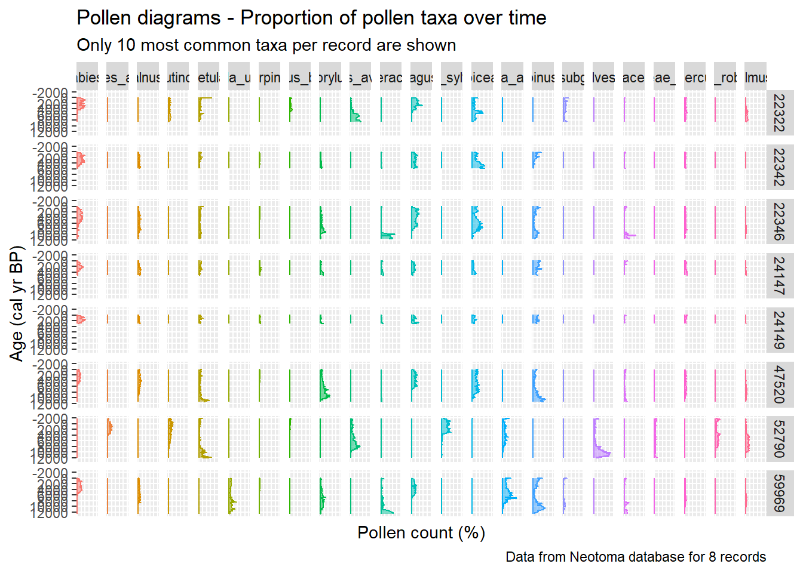

---
format:
  html:
    author: "Ondřej Mottl"
    toc: true
    keep-md: true
    code-link: true
    embed-resources: true
    code-line-numbers: true
    theme: [default, custom_theme_exercise.scss]
---


# Basic functions of neotoma2 : Working with pollen data

Simple example of woking with pollen data using the [{neotoma2} package](https://open.neotomadb.org/neotoma2/).

## Setup


::: {.cell}

```{.r .cell-code}
# load libraries
library(tidyverse) # general data wrangling and visualisation ✨
library(neotoma2) # # access to the Neotoma database 🌿
library(pander) # nice tables 😍
library(here) # for working directory 🗺️
library(janitor) # string cleaning 🧹
library(geojsonsf) # geojson spatial data 🌐

# set the working directory
here::i_am("R/Exercises/01_neotoma2_basics.qmd")

# source the plot_table() function
source(
  here::here(
    "R/Functions/plot_table.R"
  )
)

# quarto render options
options(htmltools.dir.version = FALSE)
knitr::opts_chunk$set(
  fig.width = 7,
  fig.height = 7,
  fig.align = "center",
  out.width = "100%",
  echo = TRUE
)
```
:::


## Sites


::: {.cell layout-align="center"}

```{.r .cell-code}
# check the documentation
?neotoma2::get_sites()
```
:::


### Search by IDs

Search for site by a single numeric ID:


::: {.cell layout-align="center"}

```{.r .cell-code}
neotoma2::get_sites(15799) %>% 
  plot_table()
```

::: {.cell-output .cell-output-stdout}

```

----------------------------------------------------
 siteid    sitename      lat    long    area   elev 
-------- ------------- ------- ------- ------ ------
 15799    Kulzer Moos   49.39   12.45    NA    466  
----------------------------------------------------
```


:::
:::


Search for sites with multiple IDs:


::: {.cell layout-align="center"}

```{.r .cell-code}
neotoma2::get_sites(
  c(15799, 15683)
) %>% 
  plot_table()
```

::: {.cell-output .cell-output-stdout}

```

----------------------------------------------------
 siteid    sitename      lat    long    area   elev 
-------- ------------- ------- ------- ------ ------
 15683     Windbruch    49.61   12.54    NA    495  

 15799    Kulzer Moos   49.39   12.45    NA    466  
----------------------------------------------------
```


:::
:::


Searching for Sites by Name. Notet that `%` is a wildcard character:


::: {.cell layout-align="center"}

```{.r .cell-code}
neotoma2::get_sites(sitename = "Alex%") %>% 
  plot_table()
```

::: {.cell-output .cell-output-stdout}

```

------------------------------------------------------------
 siteid        sitename         lat     long    area   elev 
-------- -------------------- ------- -------- ------ ------
   24       Alexander Lake     53.33   -60.58    NA     73  

   25        Alexis Lake       52.52   -57.03    NA    193  

  4478    Alexander [3CN117]   35.25   -92.62    NA    180  

 26226      Alexandra Lake     43.29   -74.17    NA    351  
------------------------------------------------------------
```


:::
:::


### Searching for Sites by Age

Record span at least 8200 years:


::: {.cell layout-align="center"}

```{.r .cell-code}
neotoma2::get_sites(
  ageof = 8200,
  all_data = FALSE # this will only show 25 records
) %>% 
 plot_table(head = TRUE)
```

::: {.cell-output .cell-output-stdout}

```

-----------------------------------------------------------------------
 siteid             sitename              lat      long    area   elev 
-------- ------------------------------ -------- -------- ------ ------
   11     Konus Exposure, Adycha River   67.75    135.6     NA    137  

   12            Ageröds Mosse           55.93    13.43     NA     47  

   15               Aguilar              -23.83   -65.75    NA    3828 

   19       Akulinin Exposure P1282      47.12    138.6     NA    367  

   20               Akuvaara             69.12    27.67     NA    159  

   25             Alexis Lake            52.52    -57.03    NA    193  
-----------------------------------------------------------------------
```


:::
:::


Record must PARTLY span the age range


::: {.cell layout-align="center"}

```{.r .cell-code}
neotoma2::get_sites(
  minage = 5000,
  maxage = 8000,
  all_data = FALSE # this will only show 
) %>% 
 plot_table(head = TRUE)
```

::: {.cell-output .cell-output-stdout}

```

-----------------------------------------------------------------------
 siteid             sitename              lat      long    area   elev 
-------- ------------------------------ -------- -------- ------ ------
   7            Three Pines Bog            47     -80.12    NA    329  

   8          Abalone Rocks Marsh        33.96     -120     NA     9   

   9                 Adange              43.31    41.33     NA    2065 

   11     Konus Exposure, Adycha River   67.75    135.6     NA    137  

   12            Ageröds Mosse           55.93    13.43     NA     47  

   15               Aguilar              -23.83   -65.75    NA    3828 
-----------------------------------------------------------------------
```


:::
:::


Record must COMPLETELY span the age range


::: {.cell layout-align="center"}

```{.r .cell-code}
neotoma2::get_sites(
  ageyounger = 5000,
  ageolder = 8000,
  all_data = FALSE # this will only show 25 records
) %>% 
 plot_table(head = TRUE)
```

::: {.cell-output .cell-output-stdout}

```

--------------------------------------------------
 siteid   sitename    lat     long    area   elev 
-------- ---------- ------- -------- ------ ------
   1        15/1     55.09   -75.25    NA    244  

   2        15/2     55.83   -75.02    NA    261  

   3        16/1     55.41   -75.07    NA    290  

   4        17/1     55.07   -75.7     NA    235  

   5        17/2     55.25   -74.93    NA    300  

   6        17/3     55.12   -75.95    NA    278  
--------------------------------------------------
```


:::
:::


## Datasets

You can search by all the same age properties as for sites (`ageof`, `minage`, `maxage`, `ageyounger`, `ageolder`).


::: {.cell layout-align="center"}

```{.r .cell-code}
# check the documentation
?neotoma2::get_datasets()
```
:::


### Search by IDs


::: {.cell layout-align="center"}

```{.r .cell-code}
neotoma2::get_datasets(
  c(5, 10, 15, 20)
) %>% 
 plot_table(head = TRUE)
```

::: {.cell-output .cell-output-stdout}

```

---------------------------------------------------------------------
 siteid            sitename             lat      long    area   elev 
-------- ---------------------------- -------- -------- ------ ------
   5                 17/2              55.25    -74.93    NA    300  

   10     Site 1 (Cohen unpublished)   30.83    -82.33    NA     36  

   15              Aguilar             -23.83   -65.75    NA    3828 

   20              Akuvaara            69.12    27.67     NA    159  
---------------------------------------------------------------------
```


:::
:::


### Search by type


::: {.cell layout-align="center"}

```{.r .cell-code}
neotoma2::get_datasets(
  all_data = FALSE, # running with `all_data = TRUE` is heavy on the server
  datasettype = "pollen"
) %>% 
 plot_table(head = TRUE)
```

::: {.cell-output .cell-output-stdout}

```

-----------------------------------------------------------------------
 siteid             sitename              lat      long    area   elev 
-------- ------------------------------ -------- -------- ------ ------
   7            Three Pines Bog            47     -80.12    NA    329  

   8          Abalone Rocks Marsh        33.96     -120     NA     9   

   9                 Adange              43.31    41.33     NA    2065 

   11     Konus Exposure, Adycha River   67.75    135.6     NA    137  

   12            Ageröds Mosse           55.93    13.43     NA     47  

   13           Aguas Calientes          -23.08   -67.4     NA    4233 
-----------------------------------------------------------------------
```


:::
:::


### Search by geo location

Go to [geojson.io](https://geojson.io/) and get the coordinates of a polygon.

For example:


::: {.cell layout-align="center"}

```{.r .cell-code}
{
        "type": "FeatureCollection",
        "features": [
          {
            "type": "Feature",
            "properties": {},
            "geometry": {
              "coordinates": [
                [
                  ...
                ]
              ],
              "type": "Polygon"
            }
          }
        ]
      }
```
:::


Now, we can use the coordinates to search for datasets:


::: {.cell layout-align="center"}

```{.r .cell-code}
sel_polygon <-
  geojsonsf::geojson_sf(
    '{
        "type": "FeatureCollection",
        "features": [
          {
            "type": "Feature",
            "properties": {},
            "geometry": {
              "coordinates": [
                [
                  [
                    8.885566596626347,
                    49.771446037909755
                  ],
                  [
                    10.222591262669596,
                    48.31793402541106
                  ],
                  [
                    12.353498585013057,
                    47.56711633708565
                  ],
                  [
                    16.327096438141012,
                    48.350003278892444
                  ],
                  [
                    16.435889807717132,
                    49.83389459390426
                  ],
                  [
                    16.022485237853516,
                    51.17135995959822
                  ],
                  [
                    14.214447964984942,
                    51.55099235084026
                  ],
                  [
                    10.091782211463311,
                    50.45895941972614
                  ],
                  [
                    9.223835080442456,
                    50.26942261795418
                  ],
                  [
                    8.885566596626347,
                    49.771446037909755
                  ]
                ]
              ],
              "type": "Polygon"
            }
          }
        ]
      }'
  )

neotoma2::get_datasets(
  loc = sel_polygon
) %>% 
 plot_table()
```

::: {.cell-output .cell-output-stdout}

```

----------------------------------------------------------
 siteid       sitename         lat    long    area   elev 
-------- ------------------- ------- ------- ------ ------
  1399        Kameničky       49.73   15.97    NA    618  

  3152        Hroznotín       49.76   15.36    NA    503  

  3168          Spolí         48.99   14.71    NA    446  

  3169     Velanská cesta     48.77   14.93    NA    494  

  3172         Branná         48.96   14.8     NA    434  

  3173         Barbora        48.94   14.81    NA    435  

  3175    Jestřebské blato    50.6    14.61    NA    244  

  3021          Bláto         49.04   15.19    NA    649  

  3052        Chraňbož        49.77   15.37    NA    469  

  3170      Červené blato     48.86   14.8     NA    475  

  3171    Borkovická blata    49.23   14.62    NA    415  

  3174       Švarcenberk      49.14   14.7     NA    416  

  3201    Komořanské jezero   50.54   13.53    NA    172  
----------------------------------------------------------
```


:::
:::


### Filter

You can additionaly filter the compilation based on `lat`, `long`, `altitude`, `age_range_young`, and/or `age_range_old`


::: {.cell layout-align="center"}

```{.r .cell-code}
# check the documentation
?neotoma2::filter()
```
:::

::: {.cell layout-align="center"}

```{.r .cell-code}
neotoma2::get_datasets(
  loc = sel_polygon
) %>%
  neotoma2::filter(
    datasettype == "pollen" &
      altitude > 500 &
      age_range_young <= 1e3
  ) %>% 
 plot_table()
```

::: {.cell-output .cell-output-stdout}

```

--------------------------------------------------
 siteid   sitename     lat    long    area   elev 
-------- ----------- ------- ------- ------ ------
  1399    Kameničky   49.73   15.97    NA    618  

  3021      Bláto     49.04   15.19    NA    649  
--------------------------------------------------
```


:::
:::


## Downloading data

### Download individual record

Let's download a record with `datasetid` 24279


::: {.cell layout-align="center"}

```{.r .cell-code}
neotoma2::get_downloads(24279) %>% 
 plot_table()
```

::: {.cell-output .cell-output-stdout}

```
.
----------------------------------------------------
 siteid    sitename      lat    long    area   elev 
-------- ------------- ------- ------- ------ ------
 15799    Kulzer Moos   49.39   12.45    NA    466  
----------------------------------------------------
```


:::
:::


### Download multiple records

Download all records by sites


::: {.cell layout-align="center"}

```{.r .cell-code}
# get sites information
neotoma2::get_sites(sitename = "Alex%") %>%
  # get datasets information
  neotoma2::get_datasets() %>%
  # get downloads
  neotoma2::get_downloads() %>% 
  plot_table()
```

::: {.cell-output .cell-output-stderr}

```
Warning in get_datasets.sites(.): SiteID 26226 or DatasetID NA does not exist in the Neotoma DB yet or it has been removed. 
                        It will be removed from your search.
```


:::

::: {.cell-output .cell-output-stdout}

```
.......
------------------------------------------------------------
 siteid        sitename         lat     long    area   elev 
-------- -------------------- ------- -------- ------ ------
   24       Alexander Lake     53.33   -60.58    NA     73  

 26226      Alexandra Lake     43.29   -74.17    NA    351  

   25        Alexis Lake       52.52   -57.03    NA    193  

  4478    Alexander [3CN117]   35.25   -92.62    NA    180  
------------------------------------------------------------
```


:::
:::


Download all records by datasets


::: {.cell layout-align="center"}

```{.r .cell-code}
# get datasets information
neotoma2::get_datasets(
  loc = sel_polygon
) %>%
  # filter datasets
  neotoma2::filter(
    datasettype == "pollen" &
      altitude > 500 &
      age_range_young <= 1e3
  ) %>%
  # get downloads
  neotoma2::get_downloads() %>% 
  plot_table()
```

::: {.cell-output .cell-output-stdout}

```
..
--------------------------------------------------
 siteid   sitename     lat    long    area   elev 
-------- ----------- ------- ------- ------ ------
  3021      Bláto     49.04   15.19    NA    649  

  1399    Kameničky   49.73   15.97    NA    618  
--------------------------------------------------
```


:::
:::


## Working with pollen counts

### Get samples

download all records by datasets


::: {.cell layout-align="center"}

```{.r .cell-code}
data_selected_downloads <-
  neotoma2::get_datasets(
    loc = sel_polygon
  ) %>%
  # filter datasets
  neotoma2::filter(
    datasettype == "pollen" &
      altitude > 500 &
      age_range_young <= 1e3
  ) %>%
  # get downloads
  neotoma2::get_downloads()
```

::: {.cell-output .cell-output-stdout}

```
..
```


:::
:::

::: {.cell layout-align="center"}

```{.r .cell-code}
# check the documentation
?neotoma2::samples()
```
:::


Extract Sample information


::: {.cell layout-align="center"}

```{.r .cell-code}
data_selected_samples <-
  neotoma2::samples(data_selected_downloads) %>%
  as.data.frame() %>%
  tibble::as_tibble() %>%
  dplyr::mutate(
    datasetid_sampleid = paste0(datasetid, "_", sampleid)
  )

plot_table(data_selected_samples[1:5, 1:5])
```

::: {.cell-output .cell-output-stdout}

```

---------------------------------------------------------------------------
 age             agetype              ageolder   ageyounger   chronologyid 
----- ------------------------------ ---------- ------------ --------------
 236   Calibrated radiocarbon years     687         -56          25602     
                    BP                                                     

 236   Calibrated radiocarbon years     687         -56          25602     
                    BP                                                     

 236   Calibrated radiocarbon years     687         -56          25602     
                    BP                                                     

 236   Calibrated radiocarbon years     687         -56          25602     
                    BP                                                     

 236   Calibrated radiocarbon years     687         -56          25602     
                    BP                                                     
---------------------------------------------------------------------------
```


:::
:::


### Get pollen counts


::: {.cell layout-align="center"}

```{.r .cell-code}
# check the documentation
?neotoma2::taxa()
```
:::


Get vector of all "pollen" taxa


::: {.cell layout-align="center"}

```{.r .cell-code}
vec_taxa_pollen <-
  neotoma2::taxa(data_selected_downloads) %>%
  dplyr::filter(element == "pollen") %>%
  purrr::pluck("variablename") %>%
  sort()

head(vec_taxa_pollen)
```

::: {.cell-output .cell-output-stdout}

```
[1] "Abies alba"    "Acer"          "Achillea-type" "Alisma"       
[5] "Alnus"         "Amaranthaceae"
```


:::
:::


Get pollen counts


::: {.cell layout-align="center"}

```{.r .cell-code}
data_sample_pollen_counts <-
  data_selected_samples %>%
  dplyr::select("datasetid_sampleid", "value", "variablename") %>%
  # only include selected taxons
  dplyr::filter(
    variablename %in% vec_taxa_pollen
  ) %>%
  dplyr::arrange(variablename) %>%
  # turn into the wider format
  tidyr::pivot_wider(
    names_from = "variablename",
    values_from = "value",
    values_fill = 0
  ) %>%
  # clean names
  janitor::clean_names()

plot_table(data_sample_pollen_counts[1:5, 1:5]) 
```

::: {.cell-output .cell-output-stdout}

```

-----------------------------------------------------------------
 datasetid_sampleid   abies_alba   acer   achillea_type   alisma 
-------------------- ------------ ------ --------------- --------
    3935_347661           8         0           0           0    

    3935_347662           12        1           0           0    

    3935_347663           16        1           0           0    

    3935_347664           18        0           0           0    

    3935_347665           76        1           0           0    
-----------------------------------------------------------------
```


:::
:::


### Getting the age information


::: {.cell layout-align="center"}

```{.r .cell-code}
data_sample_age <-
  data_selected_samples %>%
  dplyr::distinct(datasetid_sampleid, depth, age) %>%
  dplyr::arrange(datasetid_sampleid, age)

plot_table(data_sample_age, head = TRUE)
```

::: {.cell-output .cell-output-stdout}

```

-----------------------------------
 datasetid_sampleid   depth   age  
-------------------- ------- ------
    1435_342283         0      48  

    1435_342284        2.5    274  

    1435_342285         5     507  

    1435_342286        10     1010 

    1435_342287        15     1601 

    1435_342288        20     2337 
-----------------------------------
```


:::
:::


### Plotting pollen diagram

Data wrangling


::: {.cell layout-align="center"}

```{.r .cell-code}
data_to_plot <-
  data_sample_pollen_counts %>%
  # we need to turn the pollen counts into percentages
  tibble::column_to_rownames("datasetid_sampleid") %>%
  dplyr::mutate(
    colsum = rowSums(.)
  ) %>%
  dplyr::mutate(
    dplyr::across(
      -(colsum),
      ~ (. / colsum) * 100
    )
  ) %>%
  tibble::rownames_to_column("datasetid_sampleid") %>%
  dplyr::select(-colsum) %>%
  # turn into the longer format
  tidyr::pivot_longer(
    cols = -datasetid_sampleid,
    names_to = "taxon",
    values_to = "count"
  ) %>%
  # add age information
  dplyr::left_join(
    data_sample_age,
    by = "datasetid_sampleid"
  ) %>%
  dplyr::select(
    "datasetid_sampleid", "age", "taxon", "count"
  ) %>%
  tidyr::separate(
    datasetid_sampleid,
    c("datasetid", "sampleid"),
    sep = "_"
  )

plot_table(data_to_plot, head = TRUE)
```

::: {.cell-output .cell-output-stdout}

```

-----------------------------------------------------
 datasetid   sampleid   age       taxon       count  
----------- ---------- ----- --------------- --------
   3935       347661    236    abies_alba     3.226  

   3935       347661    236       acer          0    

   3935       347661    236   achillea_type     0    

   3935       347661    236      alisma         0    

   3935       347661    236       alnus       5.242  

   3935       347661    236   amaranthaceae   0.8065 
-----------------------------------------------------
```


:::
:::


Get the most common taxa


::: {.cell layout-align="center"}

```{.r .cell-code}
vec_common_taxa <-
  data_to_plot %>%
  dplyr::group_by(datasetid, taxon) %>%
  dplyr::summarise(
    .groups = "drop",
    mean_count = mean(count, na.rm = TRUE)
  ) %>%
  dplyr::group_by(datasetid) %>%
  dplyr::arrange(
    dplyr::desc(mean_count)
  ) %>%
  dplyr::slice(1:10) %>%
  dplyr::ungroup() %>%
  dplyr::pull(taxon) %>%
  unique()
```
:::

::: {.cell layout-align="center"}

```{.r .cell-code}
data_to_plot %>%
  dplyr::filter(
    taxon %in% vec_common_taxa
  ) %>%
  ggplot2::ggplot(
    mapping = ggplot2::aes(
      x = age,
      y = count,
      fill = taxon,
      col = taxon
    )
  ) +
  ggplot2::labs(
    x = "Age (cal yr BP)",
    y = "Pollen count (%)",
    title = "Pollen diagrams - Proportion of pollen taxa over time",
    subtitle = "Only 10 most common taxa per record are shown",
    caption = paste(
      "Data from Neotoma database for",
      length(unique(data_to_plot$datasetid)),
      "records"
    )
  ) +
  ggplot2::scale_x_reverse(
    breaks = scales::pretty_breaks(n = 10)
  ) +
  ggplot2::scale_y_continuous(
    limits = c(0, 100),
    breaks = scales::pretty_breaks(n = 5)
  ) +
  ggplot2::theme(
    legend.position = "none",
    axis.text.x = ggplot2::element_blank(),
    axis.ticks.x = ggplot2::element_blank(),
    panel.grid.minor = ggplot2::element_blank()
  ) +
  ggplot2::facet_grid(datasetid ~ taxon) +
  ggplot2::coord_flip() +
  ggplot2::geom_ribbon(
    mapping = ggplot2::aes(
      ymin = 0,
      ymax = count
    ),
    alpha = 0.5
  ) +
  ggplot2::geom_line()
```

::: {.cell-output-display}
{fig-align='center' width=100%}
:::
:::
