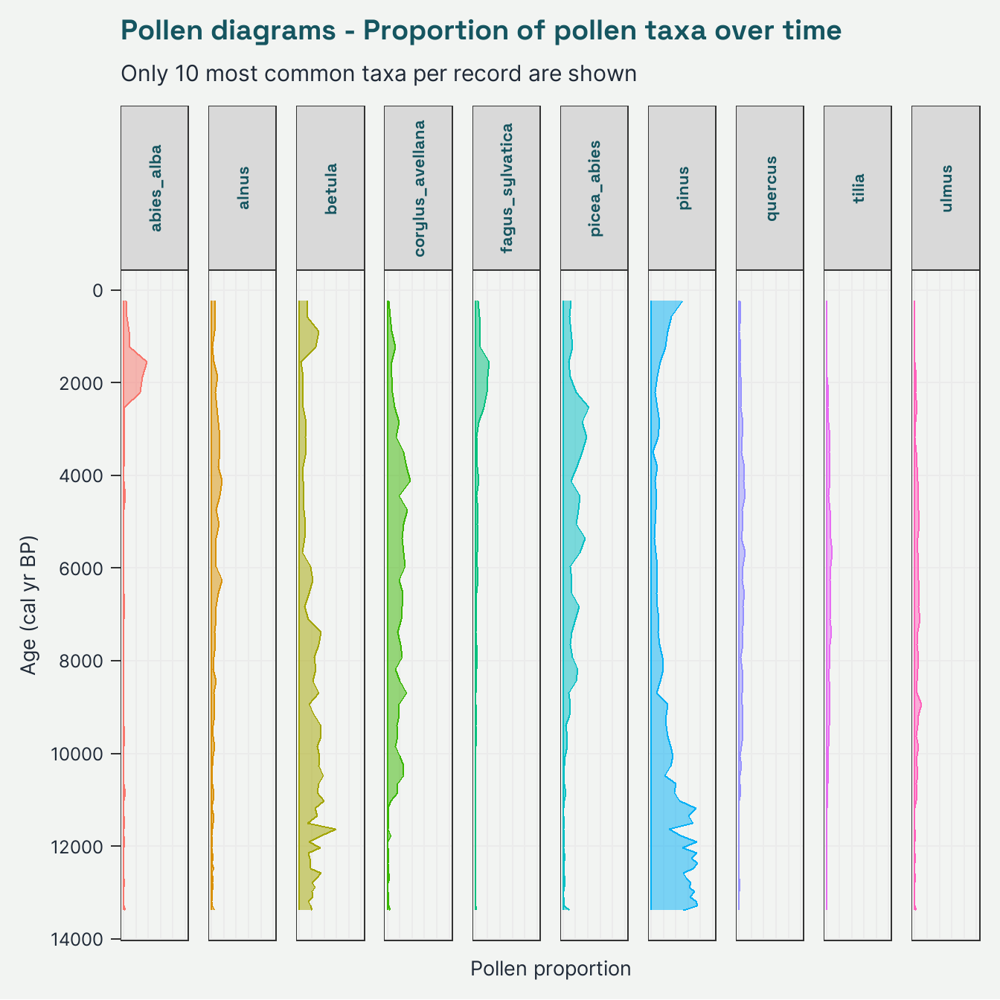

# Working with pollen data

Simple example of working with pollen data using the [{neotoma2} package](https://open.neotomadb.org/neotoma2/).

## Setup


::: {.cell}

```{.r .cell-code}
# load libraries
library(tidyverse) # general data wrangling and visualisation ✨
library(neotoma2) # # access to the Neotoma database 🌿
library(pander) # nice tables 😍
library(here) # for working directory 🗺️
library(janitor) # string cleaning 🧹
library(geojsonsf) # geojson spatial data 🌐

# set the working directory
here::i_am("R/Exercises/02_working_with_pollen_data-offline.qmd")

# source the plot_table() function
source(
  here::here(
    "R/Functions/plot_table.R"
  )
)

# quarto render options
options(htmltools.dir.version = FALSE)
knitr::opts_chunk$set(
  fig.width = 7,
  fig.height = 7,
  fig.align = "center",
  out.width = "100%",
  echo = TRUE
)
```
:::


## Get data

The are two options to get data from Neotoma database:

1. Online - directly from the Neotoma database (internet connection required)


::: {.cell layout-align="center"}

```{.r .cell-code}
data_selected_downloads <-
  neotoma2::get_datasets(
    loc = sel_polygon
  ) %>%
  # filter datasets
  neotoma2::filter(
    datasettype == "pollen" &
      altitude > 620 &
      age_range_young <= 1e3
  ) %>%
  # get downloads
  neotoma2::get_downloads()
```
:::


<br>

2. Load the pre-downloaded record (offline, no internet connection required)


::: {.cell layout-align="center"}

```{.r .cell-code}
data_selected_downloads <-
  readr::read_rds(
    here::here(
      "Data/Input/neotoma2_offline_data.rds"
    )
  )
```
:::


## Extract Sample information


::: {.cell layout-align="center"}

```{.r .cell-code}
# check the documentation
?neotoma2::samples()
```
:::


::: {.cell layout-align="center"}

```{.r .cell-code}
data_selected_samples <-
  neotoma2::samples(data_selected_downloads) %>%
  as.data.frame() %>%
  tibble::as_tibble()

plot_table(
  data_selected_samples[1:5, c("age", "variablename", "value")]
)
```

::: {.cell-output .cell-output-stderr}

```
Warning: package 'magrittr' was built under R version 4.5.1
```


:::

::: {.cell-output .cell-output-stdout}

```

--------------------------------
 age     variablename     value 
----- ------------------ -------
 236   Scrophulariaceae     1   

 236       Apiaceae         1   

 236    Ranunculaceae       1   

 236   Carpinus betulus     1   

 236    Barbarea-type       1   
--------------------------------
```


:::
:::


### Get pollen counts


::: {.cell layout-align="center"}

```{.r .cell-code}
# check the documentation
?neotoma2::taxa()
```
:::


Get vector of all "pollen" taxa


::: {.cell layout-align="center"}

```{.r .cell-code}
vec_taxa_pollen <-
  neotoma2::taxa(data_selected_downloads) %>%
  dplyr::filter(element == "pollen") %>%
  purrr::pluck("variablename") %>%
  sort()

head(vec_taxa_pollen)
```

::: {.cell-output .cell-output-stdout}

```
[1] "Abies alba"    "Acer"          "Alnus"         "Amaranthaceae"
[5] "Apiaceae"      "Artemisia"    
```


:::
:::


Get pollen counts in wide format


::: {.cell layout-align="center"}

```{.r .cell-code}
data_pollen_wide <-
  # tranform to wide format and
  neotoma2::toWide(
    x = data_selected_samples,
    variablenames = vec_taxa_pollen,
    elementtypes = "pollen",
    ecologicalgroups = c(
      "MANG",
      "PALM",
      "PLNT",
      "SUCC",
      "TRSH",
      "VASC"
    ),
    unit = "NISP"
  ) %>%
  # round all numerical values
  dplyr::mutate(
    dplyr::across(
      .cols = -age,
      .fns = ~ round(.x, 2)
    )
  ) %>%
  janitor::clean_names()

plot_table(data_pollen_wide[1:5, 1:5])
```

::: {.cell-output .cell-output-stdout}

```

------------------------------------------------------------------------
 age    carpinus_betulus   quercus   corylus_avellana   fagus_sylvatica 
------ ------------------ --------- ------------------ -----------------
 236           0            0.01           0.02              0.04       

 565           0            0.02           0.04              0.06       

 893          0.01            0            0.06              0.08       

 1221         0.01          0.02           0.12              0.07       

 1549         0.01          0.01           0.06              0.22       
------------------------------------------------------------------------
```


:::
:::


## Plotting pollen diagram

Turn back to long format for easier plotting


::: {.cell layout-align="center"}

```{.r .cell-code}
data_to_plot <-
  data_pollen_wide %>%
  tidyr::pivot_longer(
    cols = -age,
    names_to = "taxon",
    values_to = "percentage"
  )

plot_table(data_to_plot[1:10, ])
```

::: {.cell-output .cell-output-stdout}

```

-------------------------------------
 age        taxon         percentage 
----- ------------------ ------------
 236   carpinus_betulus       0      

 236       quercus           0.01    

 236   corylus_avellana      0.02    

 236   fagus_sylvatica       0.04    

 236      abies_alba         0.04    

 236        alnus            0.06    

 236   calluna_vulgaris      0.07    

 236     picea_abies         0.12    

 236        betula           0.13    

 236        pinus            0.51    
-------------------------------------
```


:::
:::


Get the most common taxa


::: {.cell layout-align="center"}

```{.r .cell-code}
n_common_taxa <- 10

vec_common_taxa <-
  data_to_plot %>%
  dplyr::group_by(taxon) %>%
  dplyr::summarise(
    .groups = "drop",
    mean_percentage = mean(percentage, na.rm = TRUE)
  ) %>%
  dplyr::arrange(
    dplyr::desc(mean_percentage)
  ) %>%
  dplyr::slice(1:n_common_taxa) %>%
  dplyr::pull(taxon) %>%
  unique()

data_to_plot_common <-
  data_to_plot %>%
  dplyr::filter(
    taxon %in% vec_common_taxa
  )
```
:::


plot pollen diagram


::: {.cell layout-align="center"}

```{.r .cell-code}
data_to_plot_common %>%
  ggplot2::ggplot(
    mapping = ggplot2::aes(
      x = age,
      y = percentage,
      fill = taxon,
      col = taxon
    )
  ) +
  ggplot2::labs(
    x = "Age (cal yr BP)",
    y = "Pollen proportion",
    title = "Pollen diagrams - Proportion of pollen taxa over time",
    subtitle = "Only 10 most common taxa per record are shown"
  ) +
  ggplot2::scale_x_reverse(
    breaks = scales::pretty_breaks(n = 10)
  ) +
  ggplot2::scale_y_continuous(
    limits = c(0, 1),
    breaks = scales::pretty_breaks(n = 5)
  ) +
  theme_ssoqe() +
  ggplot2::theme(
    legend.position = "none",
    axis.text.x = ggplot2::element_blank(),
    axis.ticks.x = ggplot2::element_blank(),
    panel.grid.minor = ggplot2::element_blank(),
    strip.text.x = ggplot2::element_text(
      angle = 90,
    )
  ) +
  ggplot2::facet_grid(~taxon) +
  ggplot2::coord_flip() +
  ggplot2::geom_ribbon(
    mapping = ggplot2::aes(
      ymin = 0,
      ymax = percentage
    ),
    alpha = 0.5
  ) +
  ggplot2::geom_line()
```

::: {.cell-output-display}
{fig-align='center' width=100%}
:::
:::

