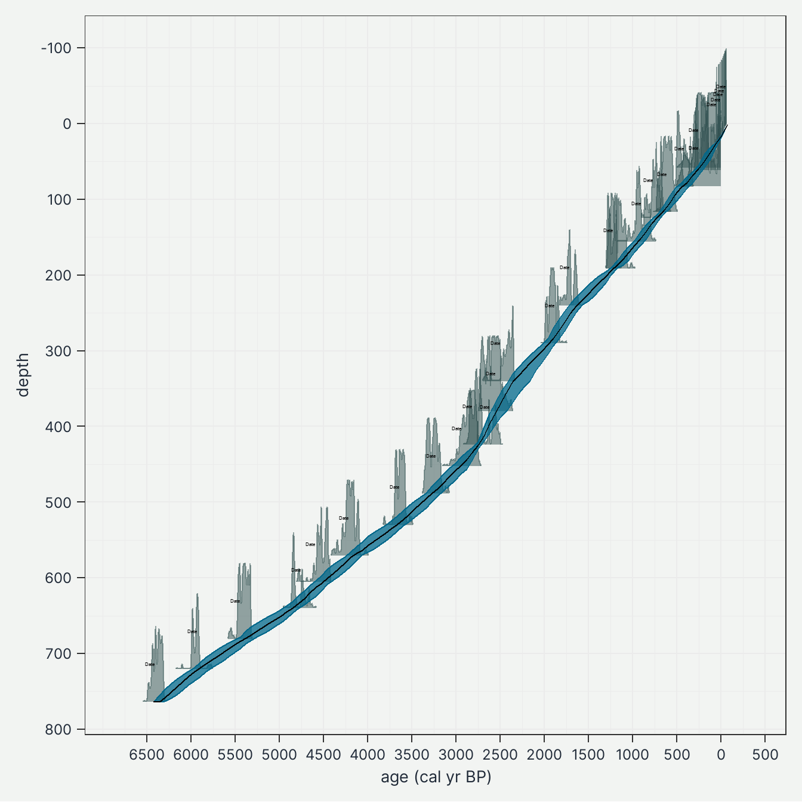
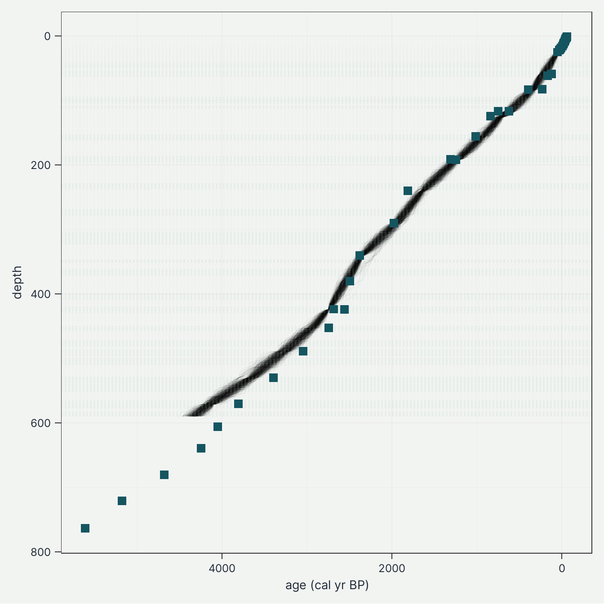
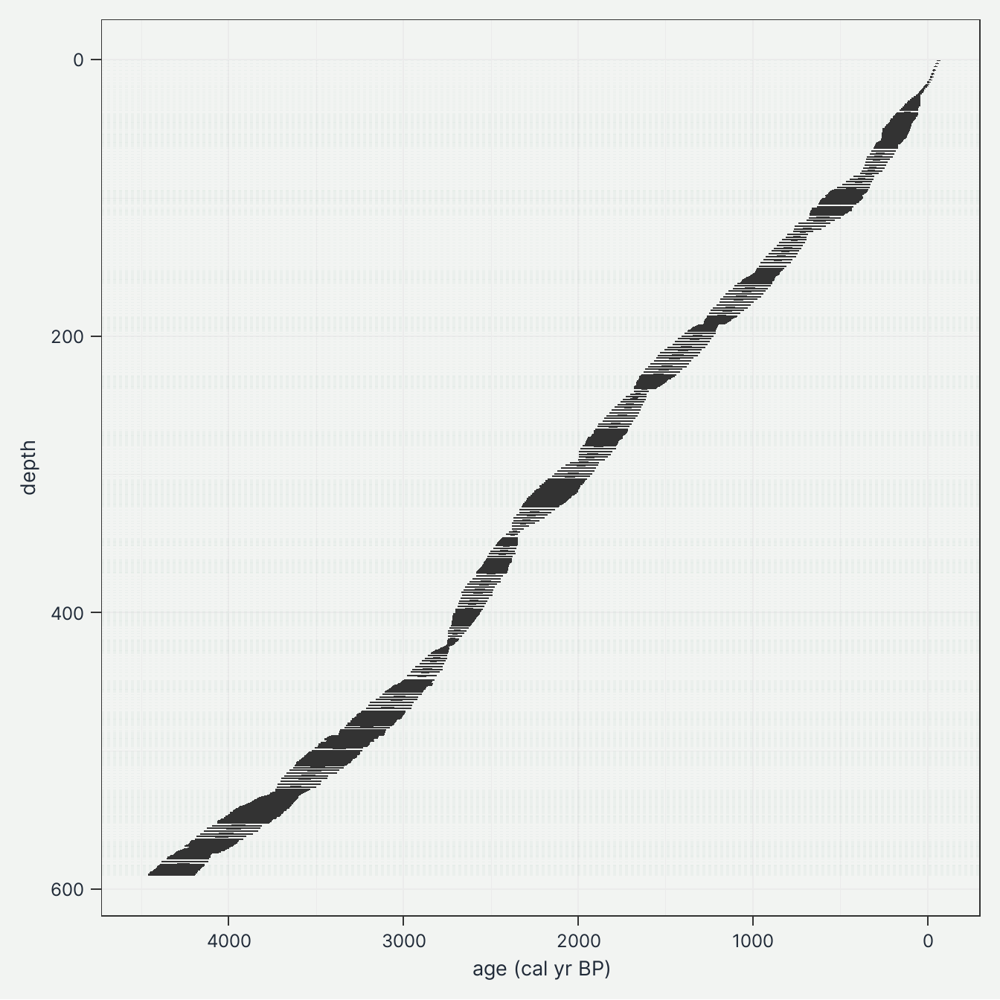
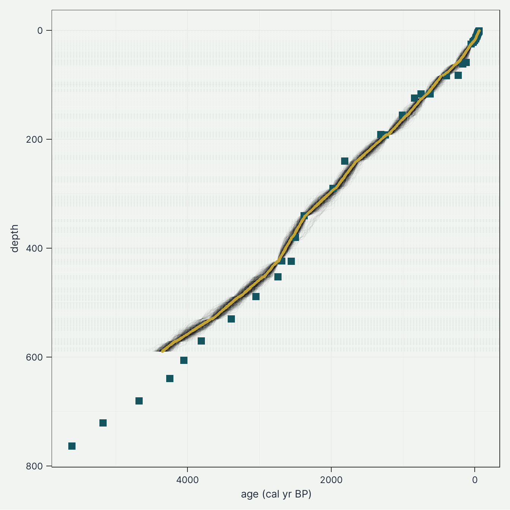

---
format:
  html:
    author: "Ondřej Mottl"
    toc: true
    toc-depth: 5
    keep-md: true
    code-link: true
    embed-resources: true
    code-line-numbers: true
    theme: [default, _exercise_theme.scss]
---

# Age Depth Modeling in R

To estimate the age of individual levels based on their depth, a chronology or age-depth model needs to be constructed. An age-depth model provides age estimates of each individual level and the full age range of the record. Most datasets in Neotoma have chronologies available and the ages of individual levels are given, but these chronologies often need updating to match current best practices in age-depth modelling . Generally, age-depth models are constructed using `chronology control points` with known depth, estimated age and associated age uncertainties. The chronology control points for each record are saved in the `chronology control table`.

## Key palaeoecological terms

-   **Chronology**: a series of estimated ages and associated uncertainty estimates fory levels in a stratigraphic record. Such estimates usually derive from an age-depth model and its associated age controls.
-   **Chronology control point(s)**: an estimate of absolute age, often with a specified uncertainty, for a level within a core or stratigraphic profile that is used to constrain an age model for that core or profile. Also called `age control`.
-   **Chronology control table**: a table that contains all the chronology control points. Includes depth, uncalibrated age of radiocarbon date and age error. Clam and Bacon require additional columns related to the reservoir effect or calibration curve used. See clam and Bacon manuals.
-   **Calibration curve**: is used to convert uncalibrated radiocarbon years (uncalibrated 14C BP) to calendar years (calibrated years before present, cal yr BP or cal yr B2K (2000 CE)). Depending on the location of the record and if the locality is marine or not, it is important to use the appropriate calibration curve. The radiocarbon calibration curve is empirically derived and is regularly updated as new observations are collected. At this time, IntCal21 is the standard calibration curve, replacing the previous IntCal13.
-   **Bayesian age model**: an age model that provides fully probabilistic estimates of the uncertainties in sample ages via the application of Bayes' theorem. Bayesian models rely upon prior assumptions about e.g. sediment accumulation rates, stratigraphic superposition and thus monotonicity of ages. Programmes that implement Bayesian age models include `Bacon`, `OxCal` and `Bchron`. Age controls may be `uncalibrated radiocarbon years` or calendar ages with uncertainties. These age models produce calibrated or calendar ages, and they can automatically deal with most cases of outlying dates.

## Setup


::: {.cell}

```{.r .cell-code}
# load libraries
library(tidyverse) # general data wrangling and visualisation ✨
library(neotoma2) # # access to the Neotoma database 🌿
library(Bchron) # age-depth modeling 🕰️
library(pander) # nice tables 😍
library(here) # for working directory 🗺️

# set the working directory
here::i_am("R/Exercises/03_age_depth_model-offline.qmd")

# source the plot_table() function
source(
  here::here(
    "R/Functions/plot_table.R"
  )
)

# quarto render options
options(htmltools.dir.version = FALSE)
knitr::opts_chunk$set(
  fig.width = 7,
  fig.height = 7,
  fig.align = "center",
  out.width = "100%",
  echo = TRUE
)
```
:::


## Getting a dataset from Neotoma

Here we have selected the **Chickaree Lake** record (ID = 47613) by Higuera, Philip E. and Dunnette, Paul V.

Reference paper: Dunnette, P.V., P.E. Higuera, K.K. McLauchlan, K.M. Derr, C.E. Briles, and M.H. Keefe. 2014. Biogeochemical impacts of wildfires over four millennia in a Rocky Mountain subalpine watershed. New Phytologist 203(3):900-912. DOI: 10.1111/nph.12828

There are two options to get data from Neotoma database:

1. Online - directly from the Neotoma database (internet connection required)


::: {.cell layout-align="center"}

```{.r .cell-code}
sel_dataset_download <-
  neotoma2::get_downloads(47613)
```
:::


2. Load the pre-downloaded record (offline, no internet connection required)


::: {.cell layout-align="center"}

```{.r .cell-code}
# Load the pre-downloaded data
sel_dataset_download <-
  readr::read_rds(
    here::here(
      "Data/Input/47613_neotoma_download.rds"
    )
  )
```
:::


<br>

Let's extract Samples.


::: {.cell layout-align="center"}

```{.r .cell-code}
data_samples <-
  neotoma2::samples(sel_dataset_download) %>%
  dplyr::distinct(sampleid, depth) %>%
  dplyr::mutate(
    sampleid = as.integer(sampleid)
  ) %>%
  dplyr::arrange(depth) %>%
  as.data.frame() %>%
  tibble::as_tibble()

plot_table(data_samples, head = TRUE)
```

::: {.cell-output .cell-output-stderr}

```
Warning: package 'magrittr' was built under R version 4.5.1
```


:::

::: {.cell-output .cell-output-stdout}

```

------------------
 sampleid   depth 
---------- -------
  439811     0.8  

  439812     2.9  

  439813     5.1  

  439814     7.8  

  439815    10.5  

  439816    12.7  
------------------
```


:::
:::


## Age-depth modelling

We will recalculate the age-depth model 'de novo' using the [{Bchron} package](http://andrewcparnell.github.io/Bchron/).

### Prepare chron.control table and run Bchron

The chronology control table contains all the dates (mostly radiocarbon) to create the age-depth model.

Again, there are two options to get data from Neotoma database:

1. Online - directly from the Neotoma database (internet connection required)


::: {.cell layout-align="center"}

```{.r .cell-code}
# First, get the chronologies and check which we want to use
sel_chron_control_table_download <-
  neotoma2::chroncontrols(sel_dataset_download)
```
:::


2. Load the pre-downloaded record (offline, no internet connection required)


::: {.cell layout-align="center"}

```{.r .cell-code}
# Load the pre-downloaded data
sel_chron_control_table_download <-
  readr::read_rds(
    here::here(
      "Data/Input/47613_neotoma_chroncontrol.rds"
    )
  )
```
:::


::: {.cell layout-align="center"}

```{.r .cell-code}
plot_table(sel_chron_control_table_download, head = TRUE)
```

::: {.cell-output .cell-output-stdout}

```

-----------------------------------------------------------------------------
 siteid   chronologyid   depth   thickness   agelimityounger   agelimitolder 
-------- -------------- ------- ----------- ----------------- ---------------
 27028       33168        0.8       1.6          -60.38           -59.62     

 27028       33168        2.4       1.1          -56.04           -55.24     

 27028       33168        3.5       1.1          -51.84             -51      

 27028       33168        4.6       2.1          -46.14           -45.22     

 27028       33168        6.7       2.2          -40.55           -39.53     

 27028       33168        8.9       2.1          -34.74           -33.58     
-----------------------------------------------------------------------------

Table: Table continues below

 
-----------------------------------------------------
 chroncontrolid   chroncontrolage   chroncontroltype 
---------------- ----------------- ------------------
     103110             -60             Lead-210     

     103111           -55.64            Lead-210     

     103112           -51.42            Lead-210     

     103113           -45.68            Lead-210     

     103114           -40.04            Lead-210     

     103115           -34.16            Lead-210     
-----------------------------------------------------
```


:::
:::


There could be several chronologies in the dataset. Here we will select the chronology table with higher values with the assumption that it is newer.


::: {.cell layout-align="center"}

```{.r .cell-code}
vec_chronologyid <-
  sel_chron_control_table_download %>%
  dplyr::distinct(chronologyid) %>%
  dplyr::arrange(
    dplyr::desc(chronologyid)
  ) %>%
  dplyr::slice(1) %>%
  purrr::chuck("chronologyid")
```
:::


Here we only present a few of the important steps of preparation of the chronology control table. There are many more potential issues, but solving those is not the focus of this workflow.


::: {.cell layout-align="center"}

```{.r .cell-code}
# prepare the table
data_chron_control_table <-
  sel_chron_control_table_download %>%
  # Here select the ID of one of the chronology
  dplyr::filter(chronologyid == vec_chronologyid) %>%
  tibble::as_tibble() %>%
  # Here we calculate the error as the average of the age `limitolder` and
  #   `agelimityounger`
  dplyr::mutate(
    error = round((agelimitolder - agelimityounger) / 2)
  ) %>%
  # As Bchron cannot accept a error of 0, we need to replace the value with 1
  dplyr::mutate(
    error = replace(error, error == 0, 1),
    error = ifelse(is.na(error), 1, error)
  ) %>%
  # We need to specify which calibration curve should be used for what point
  dplyr::mutate(
    curve = ifelse(as.data.frame(sel_dataset_download)["lat"] > 0, "intcal20", "shcal20"),
    curve = ifelse(chroncontroltype != "Radiocarbon", "normal", curve)
  ) %>%
  tibble::column_to_rownames("chroncontrolid") %>%
  dplyr::arrange(depth) %>%
  dplyr::select(
    chroncontrolage, error, depth, thickness, chroncontroltype, curve
  )

plot_table(data_chron_control_table, head = TRUE)
```

::: {.cell-output .cell-output-stdout}

```

-------------------------------------------------------------------------
 chroncontrolage   error   depth   thickness   chroncontroltype   curve  
----------------- ------- ------- ----------- ------------------ --------
       -60           1      0.8       1.6          Lead-210       normal 

     -55.64          1      2.4       1.1          Lead-210       normal 

     -51.42          1      3.5       1.1          Lead-210       normal 

     -45.68          1      4.6       2.1          Lead-210       normal 

     -40.04          1      6.7       2.2          Lead-210       normal 

     -34.16          1      8.9       2.1          Lead-210       normal 
-------------------------------------------------------------------------
```


:::
:::


As this is just a toy example, we will use only the iteration multiplier (`i_multiplier`) of `0.1` to reduce the computation time. However, we strongly recommend increasing it to 5 for any normal age-depth model construction.


::: {.cell layout-align="center"}

```{.r .cell-code}
i_multiplier <- 0.1 # increase to 5

# Those are default values suggested by the Bchron package
n_iteration_default <- 10e3
n_burn_default <- 2e3
n_thin_default <- 8

# Let's multiply them by our i_multiplier
n_iteration <- n_iteration_default * i_multiplier
n_burn <- n_burn_default * i_multiplier
n_thin <- max(c(1, n_thin_default * i_multiplier))

# run Bchron
sel_bchron <-
  Bchron::Bchronology(
    ages = data_chron_control_table$chroncontrolage,
    ageSds = data_chron_control_table$error,
    positions = data_chron_control_table$depth,
    calCurves = data_chron_control_table$curve,
    positionThicknesses = data_chron_control_table$thickness,
    iterations = n_iteration,
    burn = n_burn,
    thin = n_thin
  )
```
:::


Visually check the age-depth models


::: {.cell layout-align="center"}

```{.r .cell-code}
Bchron:::plot.BchronologyRun(sel_bchron) + # or just simple plot(sel_bchron)
  theme_ssoqe() +
  ggplot2::labs(
    x = "age (cal yr BP)",
    y = "depth"
  )
```

::: {.cell-output-display}
{fig-align='center' width=100%}
:::
:::


### Predict ages

Let's first extract posterior ages (i.e. possible ages) from the age-depth model.


::: {.cell layout-align="center"}

```{.r .cell-code}
age_position <-
  Bchron:::predict.BchronologyRun( # or just simple predict(sel_bchron)
    object = sel_bchron,
    newPositions = data_samples$depth
  )
```
:::


Wrangle the data and add `sampleid`.


::: {.cell layout-align="center"}

```{.r .cell-code}
age_uncertainties <-
  age_position %>%
  as.data.frame() %>%
  dplyr::mutate_all(., as.integer) %>%
  as.matrix()

colnames(age_uncertainties) <- data_samples$sampleid

plot_table(age_uncertainties[1:8, 1:8])
```

::: {.cell-output .cell-output-stdout}

```

-----------------------------------------------------------------------
 439811   439812   439813   439814   439815   439816   439817   439818 
-------- -------- -------- -------- -------- -------- -------- --------
  -61      -53      -45      -37      -27      -21      -12       -8   

  -61      -47      -49      -38      -27      -20      -12       -2   

  -61      -54      -41      -38      -27      -20      -11       -2   

  -61      -54      -45      -37      -27      -20      -12       -5   

  -61      -54      -43      -37      -29      -20      -12       -3   

  -59      -55      -45      -35      -29      -22      -13       -8   

  -62      -54      -44      -37      -29      -21      -10       -1   

  -60      -55      -45      -40      -29      -21      -13       -4   
-----------------------------------------------------------------------
```


:::
:::


Here we see samples (e.g., 439811, 439812, 439813,...) and their possible ages (age sequence) with each model iteration (posterior). Each age-sequence is similar but there are differences of tens or hundreds of years. We will call this *the uncertainty matrix*.

We can visualize these "possible ages" (age-sequence) of each iteration.


::: {.cell layout-align="center"}

```{.r .cell-code}
# create a data.frame for plotting
data_age_uncertainties <-
  age_uncertainties %>%
  as.data.frame() %>%
  tibble::rowid_to_column("ID") %>%
  tidyr::pivot_longer(
    cols = -ID,
    names_to = "sampleid",
    values_to = "age"
  ) %>%
  dplyr::mutate(
    sampleid = as.integer(sampleid)
  ) %>%
  dplyr::left_join(
    data_samples,
    by = dplyr::join_by(sampleid)
  )
```
:::


Each line is a single potential age-depth model iteration (age-sequence). Green points represent the radiocarbon dates. Horizontal lines are the depths of our samples.


::: {.cell layout-align="center"}

```{.r .cell-code}
(
  fig_age_uncertainties <-
    data_age_uncertainties %>%
    ggplot2::ggplot(
      mapping = ggplot2::aes(
        x = age,
        y = depth
      )
    ) +
    ggplot2::geom_line(
      mapping = ggplot2::aes(
        group = ID
      ),
      alpha = 0.05,
      linewidth = 0.1
    ) +
    ggplot2::geom_hline(
      yintercept = data_samples$depth,
      lty = 2,
      color = ssoqe_cols["cambridge_blue"],
      alpha = 0.1,
      linewidth = 0.1
    ) +
    ggplot2::geom_point(
      data = data_chron_control_table,
      mapping = ggplot2::aes(
        x = chroncontrolage
      ),
      color = ssoqe_cols["midnight_green"],
      shape = 15,
      size = 3
    ) +
    ggplot2::scale_y_continuous(trans = "reverse") +
    ggplot2::scale_x_continuous(trans = "reverse") +
    theme_ssoqe() +
    ggplot2::labs(
      x = "age (cal yr BP)"
    )
)
```

::: {.cell-output-display}
{fig-align='center' width=100%}
:::
:::


We can visualize all age-depth "possible ages" together as the range of values. Here, each line represents one sampled depth in our record.


::: {.cell layout-align="center"}

```{.r .cell-code}
data_age_uncertainties %>%
  ggplot2::ggplot(
    mapping = ggplot2::aes(
      x = age,
      y = depth,
      group = depth
    )
  ) +
  ggplot2::geom_hline(
    yintercept = data_samples$depth,
    lty = 2,
    color = ssoqe_cols["cambridge_blue"],
    alpha = 0.1,
    linewidth = 0.1
  ) +
  ggplot2::geom_boxplot(
    outlier.shape = NA
  ) +
  ggplot2::scale_y_continuous(trans = "reverse") +
  ggplot2::scale_x_continuous(trans = "reverse") +
  ggplot2::labs(
    x = "age (cal yr BP)"
  )
```

::: {.cell-output-display}
{fig-align='center' width=100%}
:::
:::


Let's take the median age of all possible ages (i.e. the estimated age from each age-depth model run) as our default.


::: {.cell layout-align="center"}

```{.r .cell-code}
data_levels_predicted <-
  data_samples %>%
  dplyr::mutate(
    age = apply(
      age_uncertainties, 2,
      stats::quantile,
      probs = 0.5
    )
  )

plot_table(data_levels_predicted, head = TRUE)
```

::: {.cell-output .cell-output-stdout}

```

------------------------
 sampleid   depth   age 
---------- ------- -----
  439811     0.8    -61 

  439812     2.9    -54 

  439813     5.1    -44 

  439814     7.8    -37 

  439815    10.5    -28 

  439816    12.7    -21 
------------------------
```


:::
:::


We can visualize the median age by drawing a gold line. This age is the age that is often reported in publications but in essence, it represents multiple age-depth model runs with smaller or larger age uncertainties throughout the record.


::: {.cell layout-align="center"}

```{.r .cell-code}
fig_age_uncertainties +
  ggplot2::geom_point(
    data = data_levels_predicted,
    color = ssoqe_cols["satin_sheen_gold"],
    size = 1
  ) +
  ggplot2::geom_line(
    data = data_levels_predicted,
    color = ssoqe_cols["satin_sheen_gold"],
    linewidth = 0.5
  )
```

::: {.cell-output-display}
{fig-align='center' width=100%}
:::
:::

